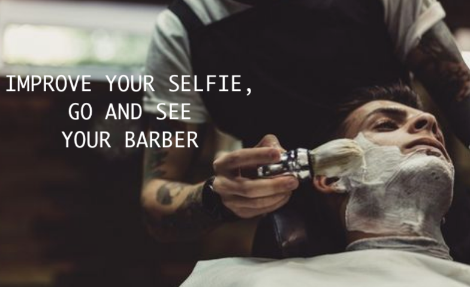
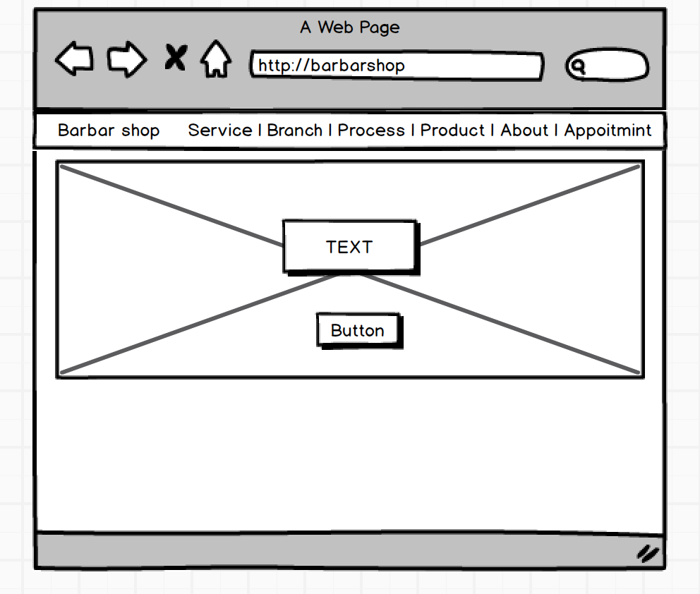
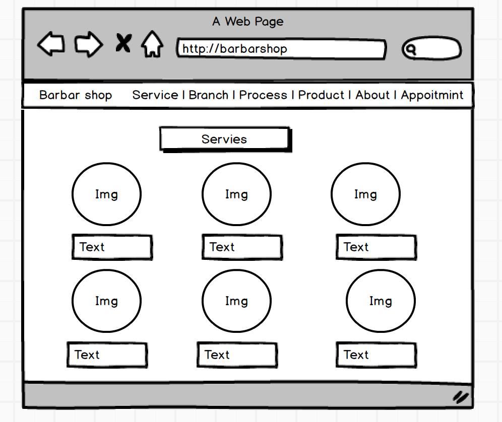

#Barber Shop

#Overview
This website was created as a part of the learning process at SEI course. The website is for Barber Shop, 

#Developer Team
- Bandar Al-Huthali
- Bandari Alotaibi
- Ahmed Arif
- Safwan AlQulayti
- Razan Sannan

#Plane

#Wireframe
Home Page

Service Page 

#Website Screenshots
pic

#Technologies Used
- Balsamiq Mockups : used for building the wireframe
- Animamaker : Video Maker
- Command Line: used for interacting with the computer, navigating the filesystem.
- Visual Studio Code: used for coding with Html, CSS, JavaScript and React, Rails, Bootstrap
- Axios: for GET requests

#Achived Requirements
- Build a web application using create-react-app.
- 7 components ( Home , About , Branch ,Product , Services , Process , Appointment)
- Props
- State properties
- SetState
- Two routes (Product , Branch )
- Used Rails to build API 

#Deliverables
- Recorded video demo

- Github repository

- Deployed 