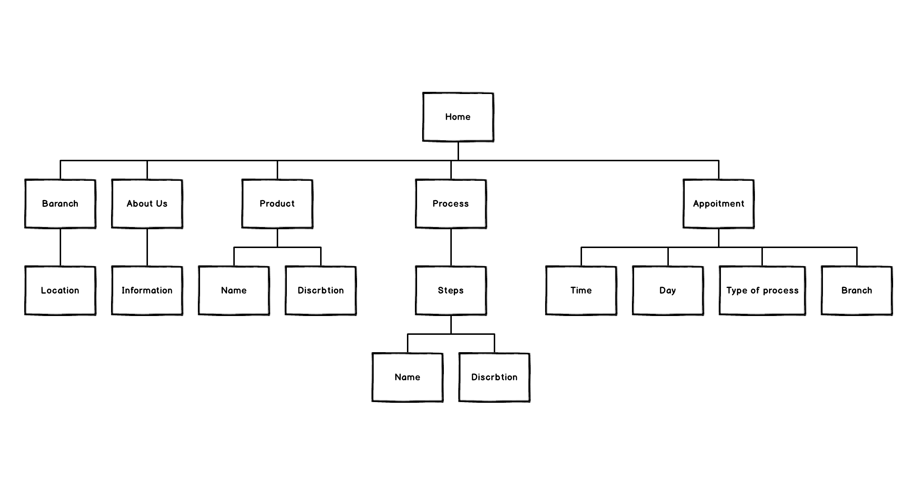
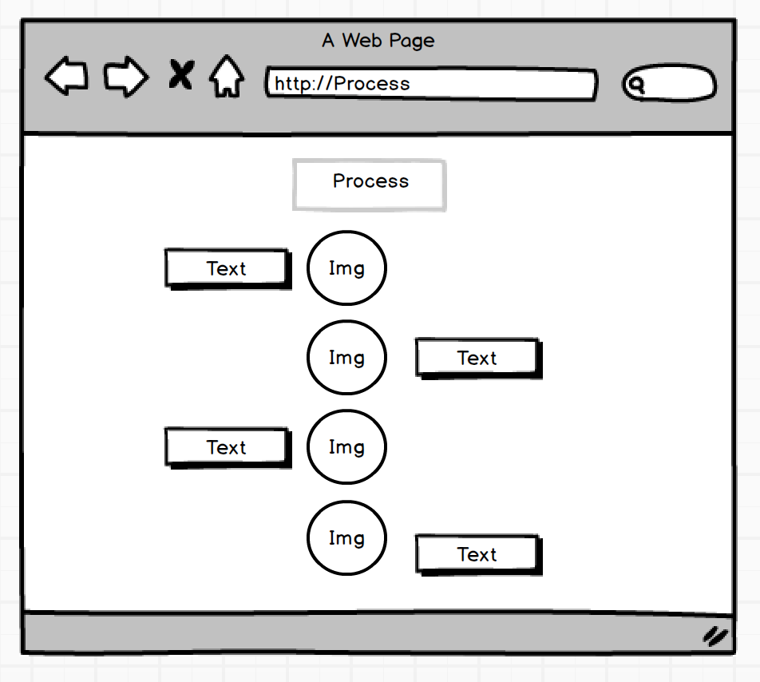
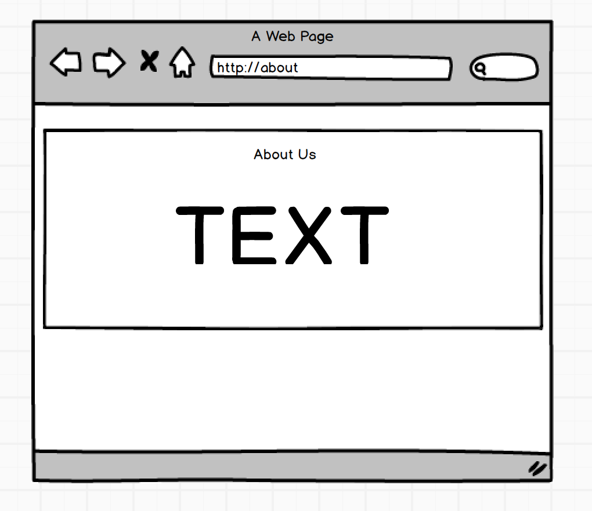
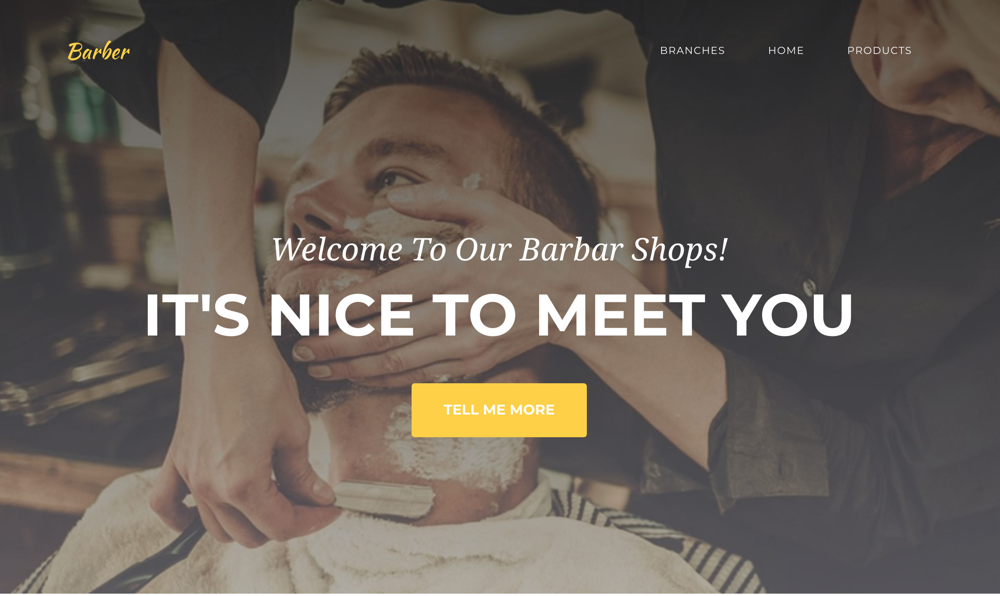
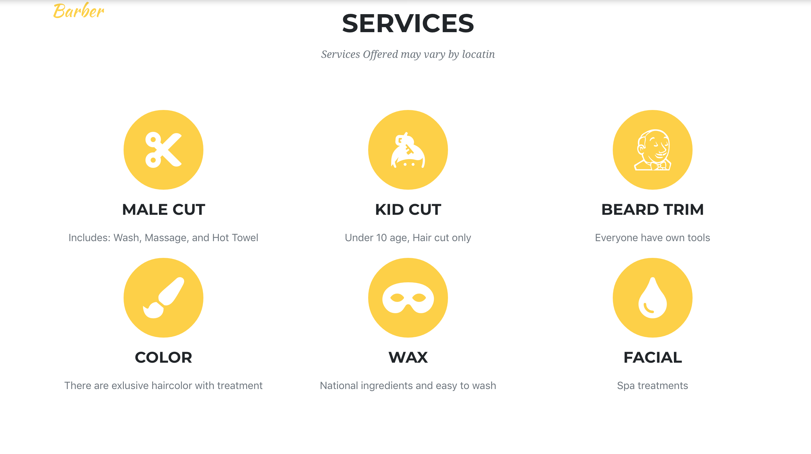
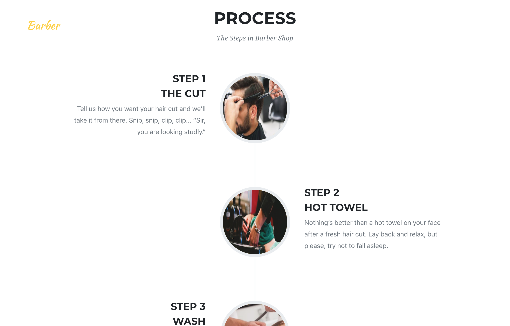
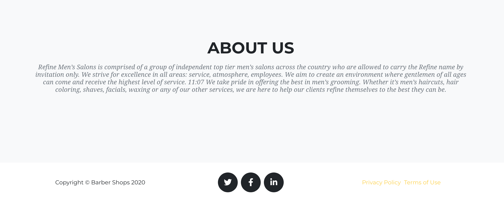

# Barber Shop

# Overview
This website was created as a part of the learning process at SEI course. The website is for Barber Shop, chose best barber shops in your area ,great service and reasonable price. They're a service that everybody needs at least once at month.

# Developer Team
- Bandar Al-Huthali
- Bandari Alotaibi
- Ahmed Arif
- Safwan AlQulayti
- Razan Sannan

# Plane

# Wireframe

🏠  Home Page 

🌟  Service Page 

📝  Process Page

👥  About Us Page

💸  Product Page

# Website Screenshots
🏠  Home Page 

🌟  Service Page 

📝  Process Page

👥  About Us Page

# Technologies Used
- Balsamiq Mockups : used for building the wireframe
- Animamaker : Video Maker
- Command Line: used for interacting with the computer, navigating the filesystem.
- Visual Studio Code: used for coding with Html, CSS, JavaScript and React, Rails, Bootstrap
- Axios: for GET requests

# Achived Requirements
- Build a web application using create-react-app.
- 7 components ( Home , About , Branch ,Product , Services , Process , Appointment)
- Props
- State properties
- SetState
- Two routes (Product , Branch)
- Used Rails to build API 

# Deliverables
- Recorded video demo
 https://youtu.be/Uvn9b-NoIPo

- Github repository

- Deployed 
